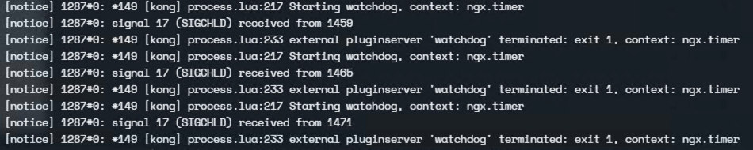
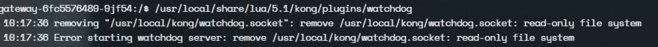

## 背景

最近在给线上的产品自定义一个网关插件, 由于对 lua 不是很熟悉，尝试了一番后果断放弃，转用 golang 实现，虽然损失一部分性能，但是实现更方便。功能实现没什么好说的，用 golang 如鱼得水一会会就写完了，也用 docker 本地测试通过。但是在 Kong Ingress Controller 环境部署时却出了问题，所以这里简单做个记录。

## 问题描述

按照文档，将 golang 编译好的二进制打包进 kong docker中，然后替换掉 helm 中的 image 字段。运行报如下错误。

pluginserver 一直在重启，没有生效。

## 问题追踪

1. 手动进入容器内查看，其中配置文件、插件二进制文件都在。
2. 尝试运行，报如下错误，可见是权限的问题错误导致的。

## 问题解决路径

1. 因为 Dockerfile 中有通过`User kong`指定了容器运行用户，所以先试图修改执行用户看看可不可以。答案是 No。。。
2. 重点放在文件系统只读，于是查到 kic 的 charts 有一个选项是 `readOnlyRootFilesystem`，默认为 true，修改为 false 即可以正常运行了。

## 启示

其实这只是一个小问题，以往遇到的问题比这个更古怪更离奇。但是我在解决的时候明显感觉到走了弯路，且很多时候都在兜兜转转做无用功。

1. 聚焦于问题本身，不要太过发散。比如刚开始我甚至去看 go-pdk 的依赖包源码试图堪破天机。
2. 不要把问题太过于妖魔化。很多问题的解决方案其实很简单，甚至越古怪离奇的问题越是由简单的操作引起的。
3. 不要太过于依赖文档和 AI。导致有些思考总是半途而废，从浏览器打开的众多 tab 页就可以看出来，思考的方式一直在转圈。
